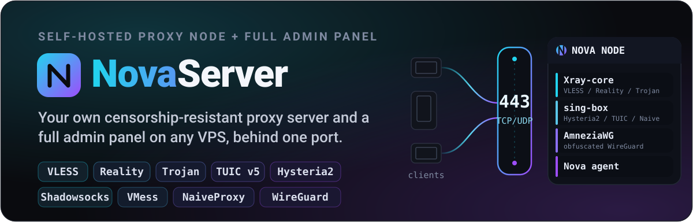
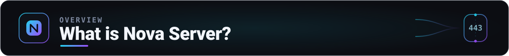
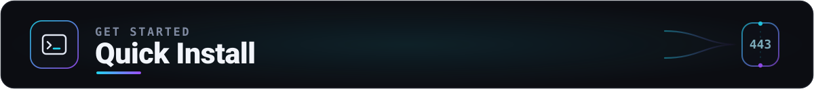
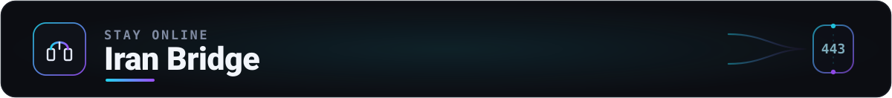
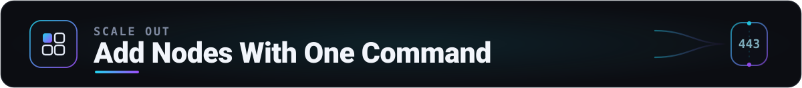
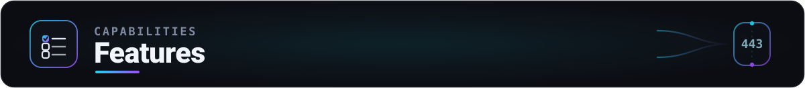
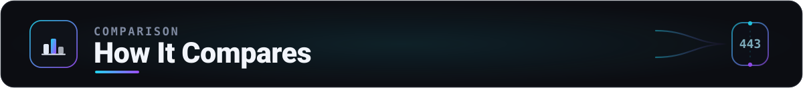
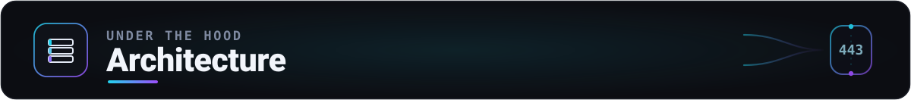
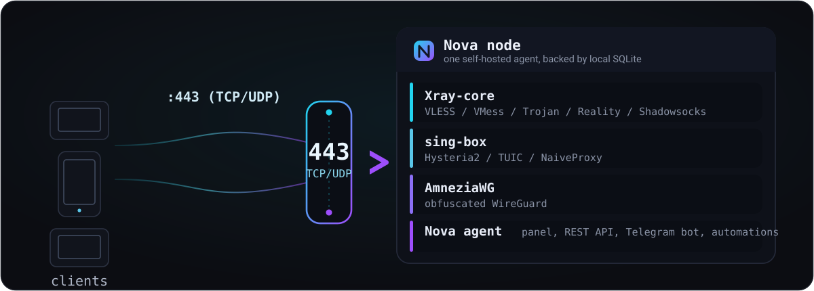

<div align="center">

<div align="right">
  <a href="README.fa.md">🇮🇷 فارسی</a>
</div>



**Your own censorship-resistant proxy server, with a full admin panel, on any VPS.**

VLESS, VMess, Trojan, Shadowsocks, Reality, Hysteria2, TUIC, NaiveProxy, WireGuard, and
AmneziaWG, behind one port, with a modern trilingual panel (English, Persian, Russian),
multi-user accounts, a multi-node fleet, Iran bridge tunnels, one-click SSL, a Telegram
bot with a Mini App, and two-factor auth.

[](LICENSE)
[](https://github.com/IRNova/Nova-Server)
[](https://github.com/IRNova/Nova-Server)

</div>

---

## 🌐 Links

<div align="center">

[](https://novaproxy.online/)
[](https://t.me/irnova_proxy)
[](https://t.me/irnovaproxy_group)
[](https://www.youtube.com/@novaproxyir)
[](https://x.com/irNovaProxy)
[](https://www.instagram.com/irnova_proxy)
[](https://donate.novaproxy.online)

</div>

---

<a id="what-is-nova-server"></a>



Nova Server turns a plain Linux VPS into a private, censorship-resistant proxy node with a **full admin panel**. It runs `Xray-core`, `sing-box` (for Hysteria2), and `AmneziaWG` behind a single port, all driven by one self-hosted agent. Where Nova Proxy runs on Cloudflare's free tier, Nova Server is the **self-hosted, more powerful sibling**: a real proxy core with everything a serious operator needs.

**What makes Nova Server different:**
- 🧩 **All the protocols that matter**: VLESS, VMess, Trojan, Shadowsocks, Reality, Hysteria2, TUIC, NaiveProxy, and native WireGuard
- ⚡ **One-scan onboarding**: a fresh install seeds a starter user with every protocol on, and the dashboard shows a Quick connect QR, so the first client is online in a single scan
- 🧭 **Automated Setup Assistant**: opens on the first panel visit and remains available for later adjustments. A few plain-language questions cover users, network restrictions, independent Iran bridge and additional-node choices, domains, Cloudflare, and the balance between simplicity, speed, and resilience. Before applying anything, it shows every protocol, transport, security method, and port it will use, then validates the plan and links directly to the secure domain, bridge, or node tools that finish it
- 🐇 **Hysteria2, hardened**: UDP port hopping over a range you pick (so no single port to block), Salamander obfuscation, and ECH to hide the SNI; the full port-hopping + ECH config is delivered in the sing-box subscription, while the private ECH key never leaves the node
- 🇮🇷 **Iran bridge tunnels with failover**: put a clean-IP server inside Iran in front of a foreign exit (Backhaul, BackPack, rathole, wstunnel); one click points every client link at the bridge across all formats (raw, Clash, sing-box), and only the ports you forward travel through the bridge; list several bridges and the exit dials all of them so clients fail over automatically if one drops; a bridge readiness check (`nova-bridge.sh --check`) confirms a direct public IP and free ports before install, and a port sweep finds a live control port when Iran blocks the default
- 🔐 **One-click SSL**: Let's Encrypt or fully automatic Cloudflare (auto DNS + wildcard), with no manual port 80 juggling
- 🌍 **Multiple domains and subdomains**: keep one primary panel address, add up to 20 trusted server aliases, issue and renew each certificate automatically, and publish each working address as an independent subscription fallback; Cloudflare orange-cloud aliases are safely limited to WebSocket
- 👥 **Full per-user control**: data quota, expiry, device limit, data reset, and per-user protocol access
- 🛰️ **Multi-node fleet**: manage many servers from one panel; add a new node by running a single panel-built command on a fresh VPS
- 🌐 **Resilience mode**: one switch spreads every config across the main server, all your nodes, and all Iran bridges, so a user's client url-tests and fails over automatically when an IP is blocked
- 🏷️ **Bridge domains with per-SNI certs**: give each Iran bridge its own domain with a valid certificate (auto-issued over Cloudflare DNS, or paste your own); the exit serves the matching cert by SNI and adds the domain to subscriptions automatically, so clients dial it directly with no allowInsecure and no duplicate tunnel control connection; the failover list stays reserved for separate Iran servers
- 🔒 **Hidden panel**: on a fresh install the panel sits behind a random secret path (with an optional dedicated port) and every other path returns a plain 404, so scanners see nothing
- 🛡️ **Login Guard**: a fail2ban-style shield that blocks an IP after too many failed attempts; on by default, with a live list of active blocks and one-click unblock
- 🔔 **Webhooks**: a signed POST to your own URL when a user is created, expires, or hits quota, when a node joins, or when an IP is blocked
- 📊 **Per-inbound traffic**: a daily traffic chart for every inbound on the Inbounds page, so you can see which entry points carry the load
- 🤖 **Telegram bot + Mini App**: run the whole panel inside Telegram
- 🛡️ **Anti-censorship exits**: WARP (with your own WARP+ license), Tor, and Psiphon, all built in
- 🚀 **Speed tuning**: TCP BBR congestion control is on by default, boosting throughput for TCP protocols (VLESS/Reality, Trojan, VMess) on Iran's lossy, high-latency routes
- ⚙️ **Automation**: backups, health alerts, auto-update, clean-IP refresh, and a first-run launcher
- 🧹 **Factory reset and log viewer**: reset everything back to a fresh install with one button (your admin login is kept), and read the last lines of the agent, Xray, or sing-box log inside the panel without SSH
- 🌍 **Trilingual panel**: English, Persian (RTL), and Russian, with a full in-panel guide

---

<a id="quick-install"></a>



On a fresh Ubuntu 20.04+ or Debian 11+ server (x86_64 or arm64), run:

```bash
bash <(curl -fsSL https://raw.githubusercontent.com/IRNova/Nova-Server/main/nova-node.sh)
```

The installer first asks a few short questions:

- **Domain**: if you have one, a free Let's Encrypt certificate is issued for it automatically. No domain is fine too: the node runs on its own IP with a self-signed certificate, and the Nova app connects either way.
- **Panel secret path**: press Enter for a random path, type your own, or use `none` to keep the panel at the root.
- **Extra panel port**: optionally a separate HTTPS port for the panel (for example `2053`). The firewall port is opened automatically.

Then the proxy cores, the panel, and the tunnel backends are set up, every available standard protocol is enabled, and a starter user named `me` is created. Open the printed panel URL, set an admin password, and scan that user's personal subscription QR from **Quick connect** on the main dashboard. The Setup Wizard remains available when you want to add a domain or customize the setup.

For a scripted (unattended) install, set everything with environment variables: `NOVA_DOMAIN`, `NOVA_DOMAIN_EMAIL`, `NOVA_PANEL_PATH` (or `none`), `NOVA_PANEL_PORT`, `NOVA_ADMIN_PASS`, and `NOVA_NO_PROMPT=1` to skip all prompts.

Forgot the password or the secret path? Reset the password from the server; the same command also prints the current panel URL:

```bash
nova-passwd 'YourNewPassword' --clear-2fa
```

Panel unreachable after a domain, Cloudflare, or SSL change? Recover access from the server without the web UI. It prints the current panel URL, and `--reset` reverts to a self-signed no-domain node (everything falls back to the server IP):

```bash
nova-access            # show the current panel URL and TLS mode
nova-access --reset    # revert to a self-signed no-domain node
```

### 🔒 The panel behind a secret path

Older builds answered the panel directly at the root (`https://server/`). Now every fresh install puts the panel behind a random secret sub-path such as `https://server/p-a1b2c3/`, and every other path returns a plain 404, so scanners probing your IP or domain see nothing (the same "web base path" idea used in 3x-ui and Marzban). You can change the path any time in **Settings > General > Panel access**, clear it to send the panel back to the root, or give the panel a separate HTTPS port (for example `2053`); the firewall port is opened automatically.

### 🌍 Multiple domains, subdomains, bridges, and nodes

Open **Domains & addresses** in the panel. The first card controls the one primary domain used by the panel. The **Additional domains** card accepts up to 20 more domains or subdomains for the same server:

1. Point the domain at this VPS, or connect Cloudflare so Nova creates the DNS record.
2. Choose automatic Let's Encrypt, automatic Cloudflare DNS, or paste an existing certificate.
3. Choose **All compatible protocols**, or **WebSocket front only** for a Cloudflare orange-cloud address.
4. Nova validates the certificate and Xray reload before the domain appears in user subscriptions. Failed or pending domains are never published.

Additional server domains are not Iran bridge addresses. A bridge domain must point at its Iran VPS and belongs under **Tunnel > Bridge domains**. A managed-node domain must point at the new node VPS and can be entered before generating its one-command installer on the **Nodes** page.

Xray protocols can select each alias certificate by SNI. Hysteria2, TUIC, and NaiveProxy use sing-box's single server certificate, so Nova adds those aliases only when the primary Cloudflare wildcard certificate is known to cover the subdomain. Otherwise those protocols safely remain on the primary domain.

---

## 🧭 New here? A step-by-step guide

Never run a server before? This is the whole path, in plain steps. Every technical word is explained the first time it appears.

1. **Rent a VPS.** A VPS is a small computer you rent on the internet that stays on around the clock, so users can connect to it any time. Any provider works; a plain Ubuntu 20.04+ or Debian 11+ box (about 4 to 6 dollars a month) is enough. You do **not** need a domain to start.

2. **Install Nova (pick just one way).**
   - **One command:** open your server's terminal (if you have never used SSH, which is just a way to type commands on the server, most providers have a browser Console button), paste the command from the Quick Install section, and press Enter. It asks a few simple questions; pressing Enter accepts the defaults.
   - **No computer:** paste the same command into your provider's cloud-init or user-data box when you create the server.
   - **Telegram:** the installer bot can do the whole thing for you.

3. **Open the panel and set a password.** The installer prints your panel URL, including a secret path (so scanners cannot find it), so save that link. Open it and set an admin password. Lost the link? Run `nova-passwd` on the server to print the current address.

4. **(Optional) Add a domain and free HTTPS.** A domain (a web address like `vpn.example.com`) and an SSL certificate (the lock that keeps the connection trusted) are optional. Without them, your node runs on its IP and the Nova app still connects. With a domain, the panel gets a free certificate automatically. You can skip this step and add it later.

5. **Scan and connect.** Nova already created the starter user `me` with access to every available protocol and all-users inbound. On the main dashboard, find **Quick connect** and scan the personal subscription QR with the Nova app, Hiddify, v2rayNG, sing-box, or Clash. You can also copy the same auto-updating link. Add separate users later when you want individual limits or access rules.

6. **Grow whenever you need to.** Add more users with data or time limits, add more entry points on the Inbounds page, stay online under heavy filtering with an Iran bridge or a DNS tunnel, and scale from one panel to many servers (nodes).

The panel itself also carries a more detailed **step-by-step setup guide** inside (at the top of the in-panel help), in English, Persian, and Russian.

---

## 🐳 Install with Docker

Prefer a container? Nova ships a Docker option as an alternative to the native one-line installer. It is reproducible, easy to stop, move, and upgrade, and your data lives on named volumes that survive a rebuild. The installer and checksum-pinned agent package are bundled into the image, and a recreated container restores its runtime without losing the persistent database or certificates.

Run this on a real Linux VPS as root. It installs Docker if it is missing, builds the image, and brings the node up:

```bash
bash <(curl -fsSL https://raw.githubusercontent.com/IRNova/Nova-Server/main/docker/nova-docker.sh)
```

You get the same installer options as the native path, passed as environment variables: `NOVA_ADMIN_PASS`, `NOVA_DOMAIN`, `NOVA_PANEL_PATH`, and `NOVA_PANEL_PORT`.

Once it is up, find the generated password and panel URL with:

```bash
cd /opt/nova-docker/docker && docker compose logs -f nova-node
```

**Important:** this method needs a real Linux host with host networking. It does **not** work on Docker Desktop for Mac or Windows, because they cannot take the host's port `443` the way a node needs. The container runs systemd inside itself and uses host networking with privileged mode, because a Nova node is a VPN appliance: it takes port `443` (on TCP and UDP), and when needed `53/udp` and a UDP port for WireGuard, and it manages systemd services. Full details are in `docker/README.md`.

---

<a id="iran-bridge"></a>



Front your foreign exit with a clean-IP server inside Iran, so clients connect to a local address that filtering leaves alone.

- Selectable backends: **Backhaul** and **BackPack** (recommended), **rathole**, and **wstunnel**.
- Carries both TCP and UDP, so Hysteria2 keeps working through the tunnel.
- **One click points every client link at the bridge**, applied across every app format (raw, Clash, sing-box), so every client type follows the bridge.
- Only the ports you forward travel through the bridge. Recommended: forward just `443` (your main VLESS link). Your other inbounds then stay direct and faster while the exit is reachable, and the VLESS-through-bridge link is your always-working fallback if the exit's IP is ever blocked, so the client's url-test gives users speed now and resilience when they need it. Add more ports only to bridge-protect those inbounds too, at the cost of an extra hop; Hysteria2 and other UDP protocols stay direct because they cannot ride the tunnel.
- A **bridge readiness check** (`nova-bridge.sh --check`) confirms a direct public IP (not NAT) and free ports before installing, and a **port-viability sweep** finds a live control port when Iran blocks the default. Both are surfaced on a bridge health card in the panel.

### 🕳️ DNS tunnel (last resort)

Nova also carries an optional built-in DNS tunnel that moves traffic inside DNS queries. Because it rides on DNS, it keeps working when everything else is blocked but DNS still answers, so it is a last-resort transport for when no other method gets through.

You pick the tunnel engine on the same card:

- **MasterDnsVPN** is the simple default.
- **CottenDns** is the more capable engine, built for very lossy or heavily monitored networks: it adds DNS-over-TLS and DNS-over-HTTPS resolver transport, load balancing across several resolvers, and recovery from packet loss. It never takes port `443`, so it runs alongside the panel.

Both listen on port `53`, so only one runs at a time; switching engines takes the port from the other. Turn it on in the panel under **Settings**. It needs a subdomain delegated to your node with an `NS` record. If your domain is on Cloudflare, the panel can create this delegation for you automatically; otherwise the in-panel guide walks you through the manual `A` and `NS` records.

This is a separate protocol: users connect with the engine's own client ([MasterDnsVPN](https://github.com/masterking32/MasterDnsVPN) or [CottenDns](https://github.com/TaJirax/CottenDns)), not the Nova app. The panel builds and exports the client config.

---

<a id="add-nodes"></a>



You no longer install a full panel on every server. Install the panel once on your main server and grow the fleet from there:

1. In the main panel, open the **Nodes** page and click **Add node with one command**. Optionally enter a domain already pointing at the new VPS; Nova will request and renew its Let's Encrypt certificate during enrollment.
2. Run the one-liner it gives you on a fresh VPS:

```bash
NOVA_JOIN_URL='https://your-panel' NOVA_JOIN_TOKEN='njt_...' bash <(curl -fsSL https://raw.githubusercontent.com/IRNova/Nova-Server/main/nova-node.sh)
```

The new server installs in **managed-node** mode: it has no standalone panel (just a plain page, with no way to log in), registers itself with the main panel automatically, and from then on everything (users, traffic, all of it) is controlled from the main panel over the node's API. The join token is single-use and expires after 24 hours. This works whether the node has a domain or runs on a bare IP with a self-signed certificate. During registration the node sends its access token over a verified TLS connection to the panel, and if the panel itself has a self-signed certificate the node also pins the panel's key, so the token cannot be sniffed in transit. (If you change or renew the panel's certificate, generate a fresh "add node" command.)

**If registration does not complete**, nothing is lost. If the main panel cannot reach the new node (usually because port 443 on it is not open to the internet yet), the node shows up on the **Nodes** page with a **Pending** status and its reason, and the attempt is logged in the activity feed. Open port 443 on that server and click Test, or add it manually. A node that fails to register is **never locked**: it stays a normal standalone panel so you can retry or manage it, and is never left stranded.

**Users and protocols are central and placed onto nodes.** You never manage a node directly. Create users on the **Users** page and protocols on the **Inbounds** page as usual, and when you add a protocol choose "Run on": this main server, one node, or **all nodes**. The panel pushes that protocol and its assigned users to the chosen node(s), and each user's subscription config uses **that node's IP** to connect through it. On the **Users** page you choose which nodes each user gets: tick specific nodes under **This user's nodes**, or turn on **Access to all nodes** so every node appears in their subscription (one config per location). The node itself just runs `xray` with the config the panel sends, and has no users or inbounds of its own to manage.

**Remove or recover a node.** On the **Nodes** page click **Remove** to drop a node from the fleet. Tick "**Completely remove Nova from that server**" to have the node wipe itself fully (`xray`, panel, and all data). To turn a managed node back into a normal standalone panel (for example when its main panel is gone), run `nova-unlock 'NewPassword'` on that server over SSH. The `nova-uninstall` command also removes Nova from any server at any time.

---

## 🛡️ Login Guard and webhooks

Two operator tools live under **Settings > Security**.

**Login Guard** is a fail2ban-style shield for the panel login. After too many failed attempts from one IP within a window, that IP is blocked for a while, so password guessing gets nowhere. It is on by default; you can tune the attempt count, the window, and the ban time, and the same page shows every active block with one-click **Unblock** (and **Clear all**).

**Webhooks** send a small signed JSON POST to your own URL when something happens on the node: a user is created, edited, or deleted, expires, or hits quota; a node registers; or an IP is blocked. Add as many URLs as you like, pick the events you want for each (or leave it on all), and set an optional secret. When a secret is set, Nova signs the body with HMAC-SHA256 and sends it in an `X-Nova-Signature: sha256=...` header, so the receiver can be sure the call really came from your node. A **Test** button sends a sample so you can confirm the connection. The payload shape is `{ event, timestamp, node, data }`.

---

<a id="features"></a>



| Area | What you get |
|------|--------------|
| **Protocols** | VLESS, VMess, Trojan, Shadowsocks-2022, VLESS-Reality (XTLS-Vision), Hysteria2, TUIC v5, NaiveProxy, native WireGuard, AmneziaWG |
| **Transports** | TCP, WebSocket, gRPC, XHTTP, HTTPUpgrade, mKCP, over TLS or Reality |
| **Users** | Data quota (total or split), expiry (fixed or from first connection), device limit, daily/weekly/monthly reset, per-user protocol and inbound access; saved plans (a reusable limit set applied to one or many users, for example 30 days / 50 GB / 3 devices), bulk actions (enable, disable, renew, reset, apply plan, or delete across selected users), and CSV import/export of users (auto-update by name) |
| **Subscriptions** | One self-updating link per user, dashboard Quick connect QR, a live usage page, and Clash/Mihomo and sing-box formats |
| **Routing** | Point-and-click geosite/geoip/CIDR/domain/protocol rules, direct Iran and domestic bypass, ad/torrent/QUIC blocking, and secure and anti-sanction DNS |
| **Egress** | Direct, block, WARP (with a WARP+ license), Tor, Psiphon, custom SOCKS/HTTP outbounds, and per-inbound egress assignment |
| **Iran tunnels** | Bridge to the exit with Backhaul, BackPack, rathole, or wstunnel; carries TCP and UDP so Hysteria2 keeps working; one-click point-all-links-at-the-bridge across every format (raw, Clash, sing-box); only forwarded ports travel through the bridge (recommended: just `443`, so other inbounds stay direct and fast with the bridged link as fallback) |
| **DNS tunnel** | Optional built-in DNS tunnel that tunnels traffic inside DNS queries, a last-resort transport for when only DNS answers, with an engine choice: MasterDnsVPN (simple default) or CottenDns (DoT/DoH resolvers, multi-resolver load balancing, loss recovery, for very hostile networks); automatic `NS` delegation on Cloudflare or guided manual setup, plus client-config export from the panel |
| **Domains and SSL** | One primary panel domain plus up to 20 additional server domains, separate Iran bridge domains, and optional managed-node domains; one-click Let's Encrypt, automatic Cloudflare DNS, or a pasted certificate; runtime validation before publication, auto-renewal, and safe WebSocket-only handling for orange-cloud aliases |
| **Panel access** | A random secret path for the panel with a plain 404 for every other path, plus an optional dedicated HTTPS port; both changeable in Settings > General; `nova-passwd` prints the current panel URL |
| **Fleet** | Register and manage many Nova nodes from one panel, aggregate users and usage, provision remotely; join a fresh VPS as a managed node with a single panel-built command (one-time token, no local panel) |
| **API and bot** | REST API with token auth (`/api/v1`) and a full Telegram bot with a Mini App that opens the whole panel in Telegram |
| **Monitoring** | Dashboard traffic charts, plus a daily traffic chart for every inbound on the Inbounds page so you can see which entry points carry the load |
| **Webhooks** | Outbound webhook to your own URL on user create/edit/delete, expiry, quota, node-join, and login-block events; each call optionally HMAC-signed (`X-Nova-Signature`) so the receiver can verify it |
| **Login Guard** | fail2ban-style per-IP blocking after repeated failed attempts (configurable threshold and ban time), a live list of active blocks, and one-click unblock; on by default |
| **Security** | Multiple admins with owner and reseller roles, two-factor auth (Google Authenticator), and server-side password reset |
| **Automation** | Nightly backups (disk and Telegram), proactive health alerts, auto-update, clean-IP refresh, health check, factory reset (back to a fresh install, keeping your admin login), and an in-panel log viewer (no SSH) |
| **Panel** | English, Persian (RTL), Russian; global search, an always-available automated Setup Assistant, per-section help and a full in-panel guide; light and dark themes |

---

<a id="how-it-compares"></a>



Nova Server and [Nova Proxy](https://github.com/IRNova/Nova-Proxy) are two ways to run the same idea. Nova Proxy runs free on a single Cloudflare Worker; Nova Server is the self-hosted, more powerful sibling on your own VPS.

| | Nova Server (this repo) | Nova Proxy |
|--|--|--|
| **Where it runs** | Any Linux VPS you own | A single Cloudflare Worker, free tier |
| **Getting started** | Rent a VPS, run one command | Deploy a Worker, no VPS or domain to start |
| **Protocol range** | The full set, including Reality, Hysteria2, TUIC, NaiveProxy, WireGuard, and AmneziaWG | VLESS, Trojan, and Shadowsocks over WebSocket, gRPC, and XHTTP |
| **UDP transports** | Native (Hysteria2, TUIC, WireGuard) | Not on Workers directly |
| **Iran bridge tunnels** | Built in | Not applicable |
| **Multi-node fleet** | Yes, many nodes from one panel | A single Worker |
| **Best when** | You want a full, self-hosted proxy core | You want a free, serverless start |

---

<a id="architecture"></a>





The agent is a single Node.js process backed by a local SQLite store. The panel, the REST API, and the Telegram bot all drive the same internal service functions.

---

## 📋 Requirements

- A VPS running **Ubuntu 20.04+** or **Debian 11+** (x86_64 or arm64)
- **Root** access
- A **domain** is optional (needed only for a trusted certificate and the Telegram Mini App)

---

## 🔄 Updating

The panel checks for new versions and updates in one click, or turn on **automatic updates**. Users, inbounds, and settings are all preserved.

---

<div align="center">

Crafted with care for a free and open internet.

**Nova Server. All rights reserved.**

<a href="https://star-history.com/#IRNova/Nova-Server&Date">Star history</a>

</div>
